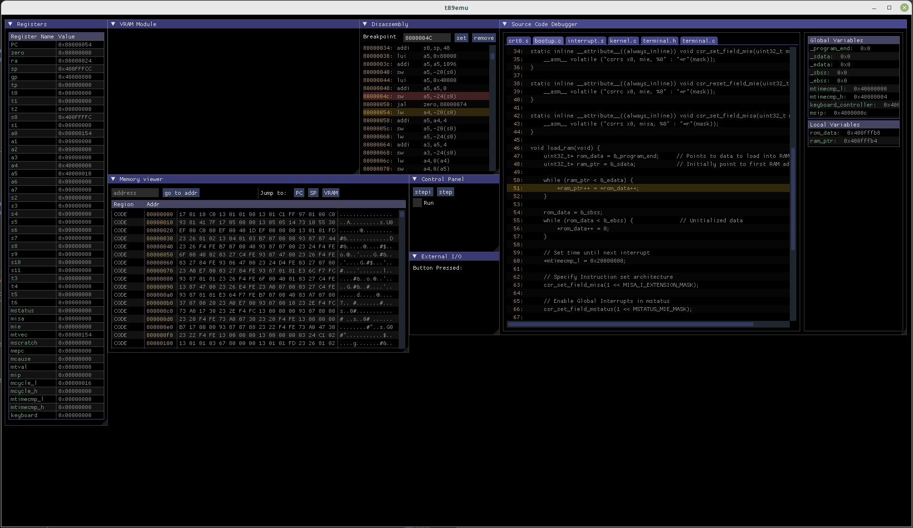

# T89-EMU
A RISC-V Emulator built for Embedded and Operating System emulation

## Features
 * 32-bit RV32I
 * C/C++ Support
 * Interrupt Handling (M-Mode)
 * Video Device (Text/Graphics Mode)
 * Debugging Interface (Disassembler, Registers, Memory Viewer)

## Usage
T89-EMU uses the RISC-V GNU Compiler Toolchain found <a href="https://github.com/riscv-collab/riscv-gnu-toolchain" target="_blank">here</a>. A guide outlining the build process can be found <a href="https://mindchasers.com/dev/rv-getting-started" target="_blank">here</a>. Most importantly, make sure to configure the cross compiler to properly target T89-EMU.

```console
$ cd riscv-gnu-toolchain/
$ mkdir build
$ cd build
$ ../configure --prefix=/opt/riscv32 --with-arch=rv32i --with-abi=ilp32
$ make
```
**Note**: The toolchain may take up to an hour to build

## Getting Started

The firmware directory provides a skeleton template for Embedded or Operating Systems development. The code provided demonstrates how to properly interface T89-EMU's hardware (see details below detailing the hardware specifications). The emulator provides a modern graphical user interface using Dear ImGui with an OpenGL/GLFW backend. To build the emulator, execute the following commands

```console
$ cd build/
$ ./build.sh
```

Once the emulator is built, navigate to the firmware directory and compiler the firmware using make
```console
$ cd ../firmware/
$ make
```
The Makefile provided compiles and links the source code, outputting an ELF file targeting the RISC-V T89-EMU architecture. After obtaining the binary, the emulator is ready to run

```console
$ cd ..
$ ./run.sh
```

A window with the application should appear allowing you to run the firmware on the emulator. Running the sample 'Hello world' application, the window should look like:


## Hardware Documentation

#### Memory Layout
Address                 | Memory Section 
---                     | --- 
0x00000000 - 0x0001FFFF | Instruction Memory
0x10000000 - 0x100FFFFF | Data Memory
0x20000000 - 0x2008FFFF | Video Memory
0x30000000 - 0x30000010 | CSR Memory

**Note**: The location of Instruction/Data Memory can be re-configured in the linker script, but the changes must also be reflected in the emulator's source code.

#### Control State Registers (CSRs)

Refer to the RISC-V privileged spec for a complete description of the control state registers. Below are details specific to T89-EMU's CSR implementation.
##### Memory-mapped CSRs
Address                 | CSR                   | Size (bytes) 
---                     | ---                   | ---
0x30000000              | mcycle                | 8
0x30000008              | mtimecmp              | 8
0x30000010              | keyboard              | 4

##### mcycle
Number of cycles since beginning of simulation

##### mtimecmp
Because the architecture is 32-bit, mtimecmp is split into 2 32-bit registers

##### keyboard
(WIP) - Buttons are mapped to a bit in the keyboard register. If a key is pressed, the corresponding bit becomes high, low otherwise

##### mstatus

Bits    | 31-13 | 12-11 | 10-8 | 7 | 6-4 | 3 | 2-0
---     | --- | --- | --- |--- |--- |--- |---
Field   | Reserved | MPP | Reserved | MPIE | Reserved | MIE | Reserved

##### mtvec
T89-EMU supports vector tables

##### mip
Bits    | 31-12 | 11 | 10-8 | 7 | 6-4 | 3 | 2-0
---     | --- | --- | --- |--- |--- |--- |---
Field   | Reserved | MEIP | Reserved | MTIP | Reserved | MSIP | Reserved

##### mie
Bits    | 31-12 | 11 | 10-8 | 7 | 6-4 | 3 | 2-0
---     | --- | --- | --- |--- |--- |--- |---
Field   | Reserved | MEIE | Reserved | MTIE | Reserved | MSIE | Reserved

#### Video Memory
The Video Memory Device divides into several sections.

Address                 | Video Segment         | Size (bytes) 
---                     | ---                   | ---
0x20000000              | Controller            | 16
0x20000010              | Text Buffer           | 1344
0x20000550              | Pixel Buffer          | 589824

##### Video Controller
Address                 | Video Segment         | Size (bytes) 
---                     | ---                   | ---
0x20000000              | Video Mode            | 1
0x20000001 - 0x2000000f | Unused                | 15

Most bytes of the video controller are unused or reserved for later use. However, the first byte defines the mode of the video controller. By default, the video mode byte initializes to 0. The video mode byte can be changed in software by setting the byte to 1 (Video Text Mode) or 2 (Video Graphics Mode, a WIP)

##### Video Text Buffer

The Video Text Buffer is a character buffer located at physical memory address 0x20000010. When Video Text Mode is enabled, the characters stores in the Video Text Buffer will be displayed to the LCD display module. The display can print up to 21 lines of characters, each line fitting a maximum of 64 characters.

##### Video Graphics Mode

The Video Graphics Buffer is a contigious array of 32-bit pixel data located at physical memory address 0x20000550. When enabled, graphics mode displays the a 512x288 resolution image to the LCD display module. This is a work in progress.

##### 32-bit Pixel
Byte    | 3   | 2   | 1   | 0   |
---     | --- | --- | --- | --- |
Field   | A | B | G | R

## Future Ideas

 * C/C++ Decompiler
 * Read firmware directly from ELF file (first implementation released)
 * Implement exceptions in vector table (soon)
 * Design a more extensive graphics mode to support Tiles/Palettes
 * Add User and Supervisor Protection Levels
 * Cleaner UI Support
 * Port build system to CMake (tentative)
 * macOS/Windows support
 * Design and run T89's architecture on an FPGA
 * Posibble extensions to project 
    - Using LLVM to create a backend to target the RISC-V architecture designed
      for T89-EMU (the scope of backend development is vast and likely warrants
      a separate project of its own)
    - Using LLVM to develop a front end for a custom programming language
    

## Developer Remarks
I am the only developer maintaining this project. I made the project to better understand my knowledge of computer science-related fields.

## Other Images

